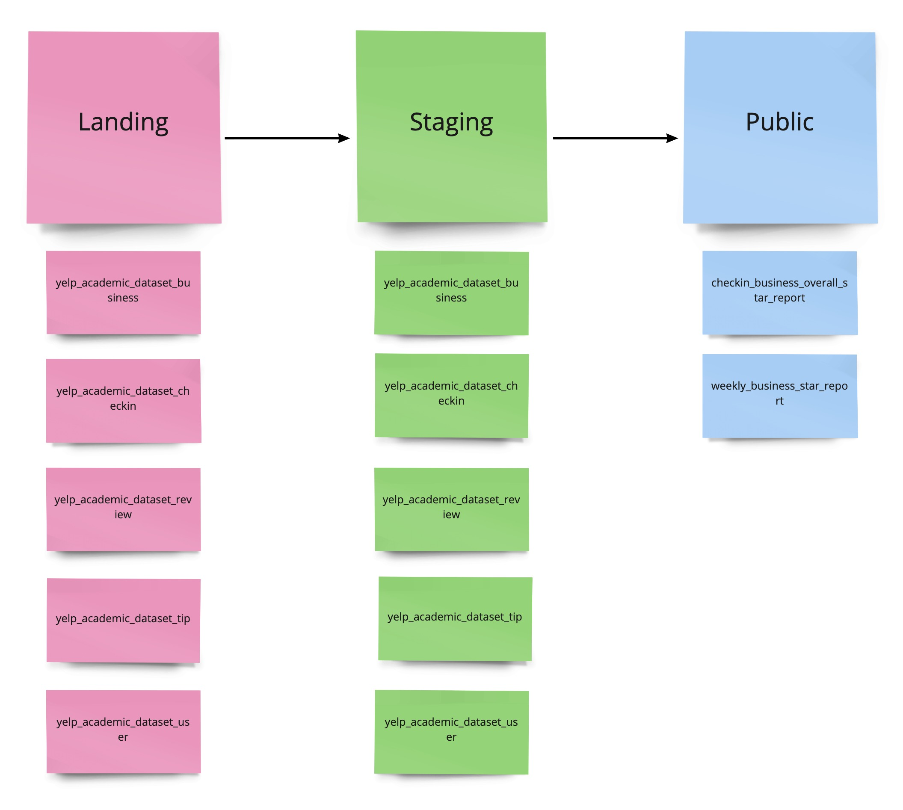
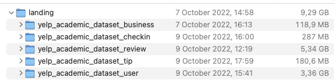
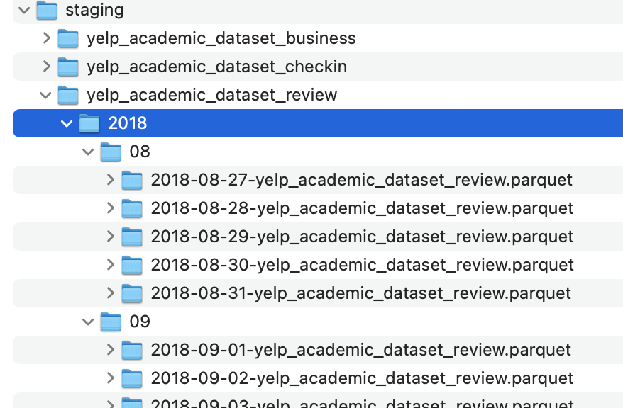
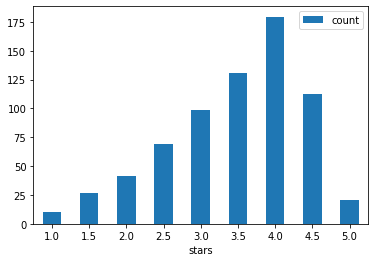
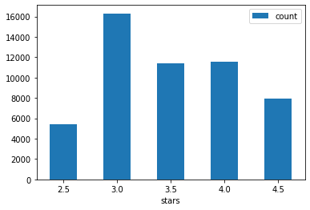

# :shipit: Data Engineer Pet Project 2 :shipit:

Pet project, that shows my **Data Engineer** skills. The goal of the project is better understanding of my skills and
experience in the Data and Software Engineering field as well as showing my approach certain questions and challenges.

## Agenda

- [Description](#description)
- [Documentation](#documentation)
- [Implementation](#implementation)

## Description

### Requirements/Restrictions :exclamation:

* It should consist of raw, cleaned and aggregated Yelp data.
* All JSON files should be part of the raw data.
* Consider all raw files for cleaning.
* The aggregation should at least include the stars per business on a
  weekly basis and the number of checkins of a business compared to
  the overall star rating.
* Write a README including a short explanation of your design decisions
  and a section on how to run your code.
* Package your Spark application as a Docker container (or multiple
  containers).

Finally, create a git bundle of your repository and send it back to the same email address that send you this
exercise once you are finished.

## Documentation

#### Data Engineer Pet Project 2

|  Project Name   | **Data Engineer Pet Project 2**                  |
|-----|--------------------------------------------------|
|   Category  | Pet project                                      |
|  Description   | project of processing and analyzing yelp dataset |
|  Tech stack   | Pytohn, PySpark, Docker, Pandas                  |
|  Office   | None                                             |
|  Status   | Done                                             |
|  ETA   | 11.10.2022                                       |

#### Team

|  Name           | Role   | Type     | Availability | Location         | Time Zone     |
| --------------  |--------| ------   |--------------|------------------|---------------|
| Karim Safiullin | Data Engineer | on bench | full time    | Germany, Ilmenau | CEST (UTC +2) |

#### Project implementation plan

1. write plan to develop app (plan + architecture) - **2h**
2. download, peek on datasets - **2h**
3. setup spark locally on laptop - **2h**
4. setup base of project - abstractions, datalake, schemas, transformations
5. setup environment, logging, mypy, pylint etc - **4h**
6. implement cleansing logic (date format etc...) - **4h**
7. write spark job transformations - **3h**
8. find anomalies, dependencies, statistics and other things - **5h**
9. implement unit tests - **3h**

#### Report

Time estimate - **~32h**
Actual time spent - **36h**

## Implementation part with my comments and thoughts.

The structure of datalake storage consists of several `stages`.



I have decided to split datalake on 3 areas:

- **Landing**, where raw yelp file are stored
- **Staging**, cleaned dataset only with required columns for further transformation and analysis
- **Public**, to store reports for further analysis

My thoughts about strong each file

Firstly before datalake implementation, I glanced on files' size.


Largest files are `review` and `user`.
The user dataset could increase much slower, that `review` dataset.
So if the assigment could be real project, after 1 year it could increase not more than twice.
So it is not necessary to split on partitions/buckets user dataset.
However, the size of review dataset will increase rapidly, so it needs to be split.
Fortunately, the review dataset has convenient for split `date` column.

As a result the `review` dataset was cleaned and distributed by `.../year/month/<date>-filename.parquet`

So further analysis could easily retrieve required files for required period of time. 
Weekly report is distributed only by `year` , because number of week doesn't relate to month. 
So the path of file looks like `.../year/<number-of-week>-filename.parquet`

### How to implement weekly basis report using review dataset

- I have decided to split review dataset on day. Because the size of the dataset much more than others.     
  Then, if user writes particular date like 08.10.2022 we should clarify,
  that is the definition of `week` (is it last 7 days or from Monday to Sunday) etc.
  So as a solution the user writes number of week (starts from January)

- Another issue would be saving weekly report if user write random date like 5.10.2022 or 9.10.2022. So how can we store
  on datalake weekly reports? That's why splitting by days is the best solution.
  So splitting by date is very convenient to create `daily`,`weekly`,`monthly` report in the further development.

### How I have cleaned the data.

- During my experience I know 2 ways how to clean data. Firstly, just **remove rows with missing data**.
  It has advantages and disadvantages.
    - On the one hand, it is the fastest way of implementing.
    - On the other hand, We could miss important data and find wrong correlation etc.
      Yelp dataset files are related to each other, so removing on `user` dataset one row could influence on
      cleaning `tip`, `review`. To solve this we should implement join and filter by the values.

- Another solution is **finding avg/mean value according to type of distribution** (poisson, gaussian etc). However,
  missed values could be anomaly is it is not precise solution.

To simplify the **cleaning** step, I use first approach - dropping null values on required fields.

### Important optimization notice

When I joined huge size `review` table with small `business` table, I used `broadcast` join, because `broadcast` join
skips high cost `shuffle` operation.

- [first broadcast join code source](./data_engineer_pet_project_2/transformers/report/period_business_star.py)  
- [second usage of broadcast](./data_engineer_pet_project_2/transformers/report/checkin_business_star.py)
```python
review_df \
        .join(f.broadcast(business_df.withColumnRenamed(stars, business_overall_stars)),
              business_df.business_id == review_df.business_id,
              how="inner"
              ) \
        .select(f.col(business_name), f.col(stars), f.col(business_overall_stars)) \
        .orderBy([f.col(stars)], ascending=False)
```
Here business dataframe is sent to all nodes in the cluster. 

### Reports

  
This chart describes comparison between overall buiness stars and average number of checkins

However, after removing `outliers` we have another situation.
After that I exclude `anomalies`. I cleaned the biggest and the least values and set border of 10%. So the number of checkins tha less than `5213` and more than `46920` was excluded.  



